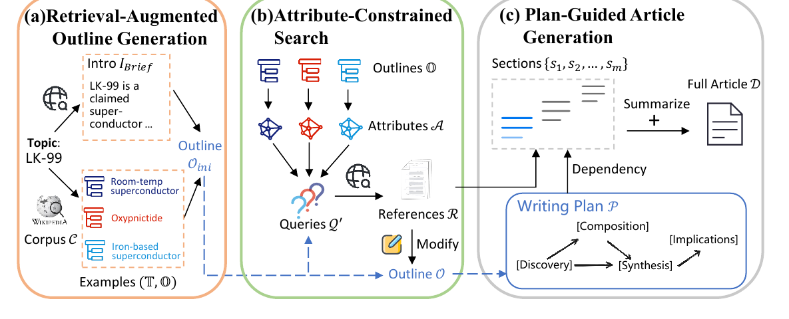

# RaPID

Official implementation for **RAPID: Efficient Retrieval-Augmented Long Text Generation with Writing Planning and Information Discovery**.

[](https://aclanthology.org/2025.findings-acl.859/)
[](https://arxiv.org/abs/2503.00751)
[](https://ustc-starteam.github.io/RaPID/)

## 1. Paper

Hongchao Gu, Dexun Li, Kuicai Dong, Hao Zhang, Hang Lv, Hao Wang, Defu Lian, Yong Liu, and Enhong Chen. **RAPID: Efficient Retrieval-Augmented Long Text Generation with Writing Planning and Information Discovery**. In *Findings of the Association for Computational Linguistics: ACL 2025*, pages 16742-16763, Vienna, Austria, 2025.

[Paper](https://aclanthology.org/2025.findings-acl.859/) / [PDF](https://aclanthology.org/2025.findings-acl.859.pdf) / [arXiv](https://arxiv.org/abs/2503.00751) / [Project Page](https://ustc-starteam.github.io/RaPID/) / [Citation](#12-citation)

RaPID is an efficient framework for generating knowledge-intensive long texts such as wiki-style articles. It combines retrieval-augmented outline generation, attribute-constrained information discovery, and plan-guided article generation to reduce hallucination, improve coherence, and lower latency.

## 2. Highlights

- Generates long-form, knowledge-intensive articles with retrieval support.
- Uses a writing plan to maintain global structure and thematic coherence.
- Adds attribute-constrained search for efficient information discovery.
- Supports console and batch-style file interfaces.
- Provides data resources through Google Drive for the wiki dump and encoded retrieval files.

## 3. Method At A Glance



RaPID first drafts a retrieval-grounded outline, then discovers missing information through attribute-constrained search, and finally generates and polishes the article under the writing plan.

## 4. Repository Structure

```text
.
├── example.py               # Console and batch entry point
├── requirements.txt
├── src/                     # RaPID pipeline modules
├── FreshWiki-2024/          # FreshWiki benchmark data in the repository
├── secrets.toml             # Local API-key config, should not be committed
└── docs/                    # GitHub Pages project page
```

## 5. Installation

```bash
conda create -n rapid python=3.10
conda activate rapid
pip install -r requirements.txt
```

## 6. Data

Download the data files from [Google Drive](https://drive.google.com/drive/folders/1GNWE0ZEPijFpdjuPOfWLjWwEcQYq3Kz2).

Expected directory layout:

```text
wiki_dump/
├── encode/
│   └── merged_encoded_vectors.pkl
├── original/
│   └── combined.jsonl
└── titles.csv
```

The repository also includes `FreshWiki-2024/` data files for batch-style experiments.

## 7. Quick Start

Create a local `secrets.toml`:

```toml
OPENAI_API_KEY = "your-llm-api-key"
GOOGLE_API_KEY = "your-search-api-key"
GOOGLE_CX = "your-search-engine-id"
```

Console example:

```bash
python example.py --retriever google \
  --output-dir ./results \
  --max-thread-num 3 \
  --do-clarify \
  --do-research \
  --do-generate-outline \
  --do-generate-article \
  --do-topo-generation \
  --do-polish-article \
  --interface console
```

Batch example:

```bash
python example.py --retriever google \
  --output-dir ./results \
  --max-thread-num 3 \
  --do-clarify \
  --do-research \
  --do-generate-outline \
  --do-generate-article \
  --do-topo-generation \
  --do-polish-article \
  --interface file \
  --input-dir ./FreshWiki-2024/final.csv
```

## 8. Reproducing Results

Use the ACL paper's evaluation setup with the downloaded wiki dump and the FreshWiki-2024 input file. The command flags above expose the main generation stages so each step can be enabled or disabled during ablations.

## 9. Configuration Notes

- Keep API keys in `secrets.toml` and do not commit private credentials.
- `--retriever google` uses Google search credentials from `secrets.toml`.
- `--max-thread-num` controls concurrent generation/retrieval threads.
- `--interface console` is interactive; `--interface file` consumes the input file.

## 10. Experimental Highlights

The paper evaluates RaPID on FreshWiki-2024, a benchmark built from 100 Wikipedia topics updated in 2024.

| Evaluation slice | Reported result | Takeaway |
| --- | --- | --- |
| Article quality | With GPT-4o, RaPID reports **F1@300 73.57** and **Info Diversity 0.650**; with Qwen-Max, **F1@300 77.98** and **Info Diversity 0.650**; with DeepSeek-v3, **F1@300 73.62** and **Info Diversity 0.670**. | RaPID improves factual-density and information-diversity metrics across backbones. |
| Outline quality | Outline F1 reaches **10.86** with Qwen-Max, **16.07** with DeepSeek-v3, and **17.52** with GPT-4o. | Retrieval-augmented outline generation improves topic coverage before article writing. |
| Human evaluation | Human annotators preferred RaPID over STORM in **27** paired comparisons versus **13** for STORM. | The automatic gains are reflected in human preference. |
| Pipeline efficiency | RaPID uses **31.04 API calls** and **127.19s** per article on average, compared with STORM's **88.06 calls / 163.22s** and Co-STORM's **70.30 calls / 154.14s**. | Attribute-constrained search reduces pre-writing cost without switching to slow multi-agent discussion. |

**Conclusion:** RaPID's result story is a quality-efficiency tradeoff: better outline/article quality than simple RAG baselines while using fewer calls and less time than heavier STORM-style pipelines.

## 11. Notes For Maintainers

- Keep `FreshWiki-2024/` paths in the README aligned with the actual repository paths.
- The repository includes `secrets.toml`; verify that committed values are examples only before future releases.
- When adding new retrievers, document the required keys in `secrets.toml`.

## 12. Citation

If you use this code in your research, please cite:

```bibtex
@inproceedings{gu-etal-2025-rapid,
  title={{RAPID}: Efficient Retrieval-Augmented Long Text Generation with Writing Planning and Information Discovery},
  author={Gu, Hongchao and Li, Dexun and Dong, Kuicai and Zhang, Hao and Lv, Hang and Wang, Hao and Lian, Defu and Liu, Yong and Chen, Enhong},
  booktitle={Findings of the Association for Computational Linguistics: ACL 2025},
  pages={16742--16763},
  year={2025},
  address={Vienna, Austria},
  publisher={Association for Computational Linguistics},
  url={https://aclanthology.org/2025.findings-acl.859/},
  doi={10.18653/v1/2025.findings-acl.859}
}
```

## 13. Contact

- First author: Hongchao Gu.
- Repository questions: please open a GitHub issue in this repository.

## 14. Acknowledgments

This codebase is primarily based on the original [STORM](https://github.com/stanford-oval/storm) implementation. We thank the STORM authors for their valuable contributions.
